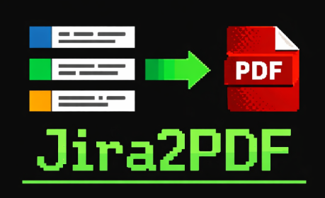
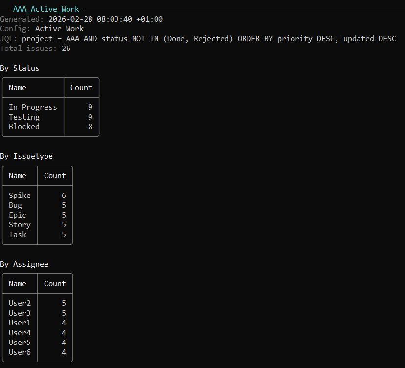
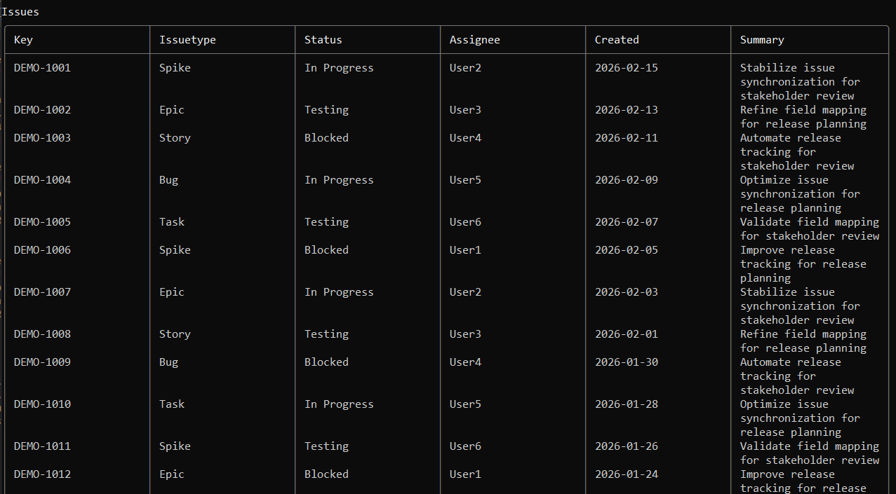
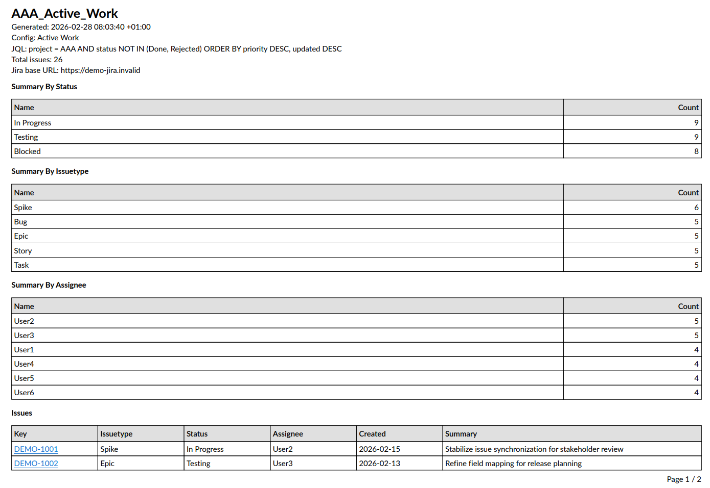
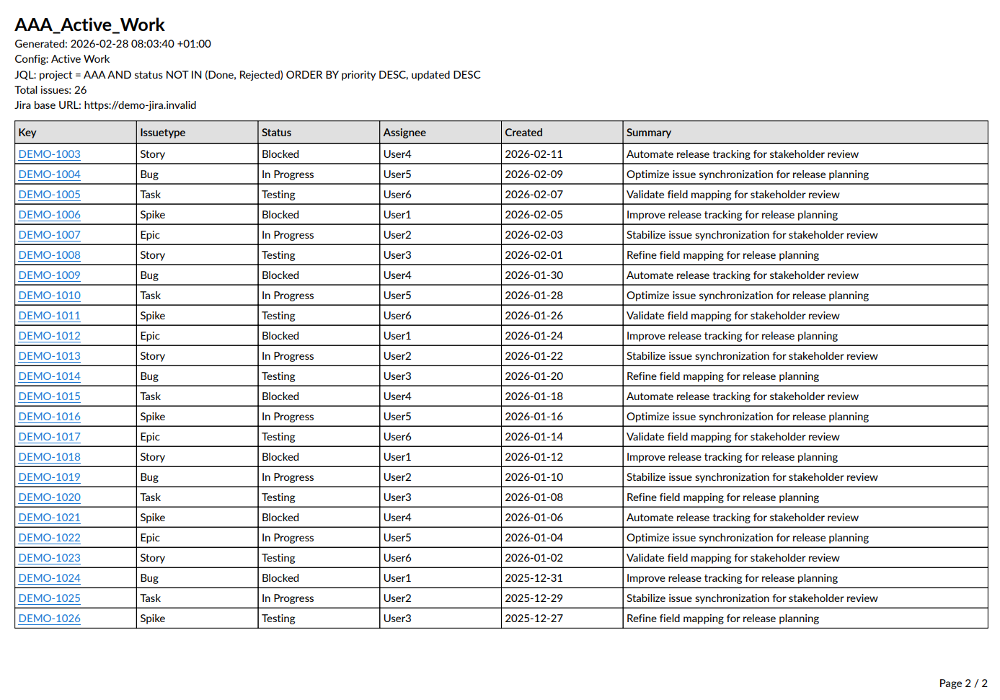

# Jira2PDF



Jira2PDF is a .NET 10 console utility that:
- loads Jira issues by JQL,
- shows a Spectre.Console report in terminal,
- generates a PDF report with the same data,
- optionally saves the same issue rows into CSV.


## Features

- Interactive report selection from `Jira:Reports`.
- Loading UI while data is being prepared (`Preparing report...`, `Preparing PDF...`).
- Console summary:
  - total issues,
  - grouped counts by configurable fields,
  - issue table (first 50 rows in console).
- PDF export with:
  - summary tables,
  - full issue list,
  - clickable issue links (`{BaseUrl}/browse/{KEY}`).
- Optional CSV export with:
  - top-level `CSV` config section,
  - optional header row,
  - companion `_raw.csv` file next to the PDF.
- Retry policy for transient HTTP errors.
- Jira search compatibility:
  - first tries `rest/api/3/search/jql`,
  - falls back to `rest/api/3/search?startAt=...` when needed.

## Tech Stack

- .NET 10 (`net10.0`)
- Spectre.Console
- QuestPDF
- Microsoft.Extensions.Hosting + Options + Configuration

## Prerequisites

- .NET SDK 10 installed.
- Jira Cloud account with API token.
- Network access to your Jira instance.

## Quick Start

1. Configure `src/appsettings.json` (example below).
2. Run from repo root:

```powershell
dotnet run --project .\src\JiraReport.csproj
```

3. Select report config.
4. Confirm/change PDF output path.
5. Get console report + generated PDF file.

## Configuration

Configuration file path: `src/appsettings.json`  
Main section: `Jira`

### Full Example

```json
{
  "Jira": {
    "BaseUrl": "https://example-company.atlassian.net",
    "Email": "report.bot@example-company.com",
    "ApiToken": "YOUR_JIRA_API_TOKEN",
    "MaxResultsPerPage": 100,
    "RetryCount": 3,
    "Reports": [
      {
        "Name": "Completed Work - January",
        "Jql": "project in (APP, OPS) AND status in (Done, Closed, Resolved) AND updated >= \"2026-01-01\" AND updated < \"2026-02-01\" ORDER BY updated DESC",
        "OutputFields": [ "key", "issuetype", "status", "assignee", "updated", "summary" ],
        "CountFields": [ "status", "assignee" ],
        "PdfReportName": "APP_OPS_Completed_Jan_2026"
      },
      {
        "Name": "High Priority In Progress",
        "Jql": "project = APP AND priority in (High, Highest) AND status in (\"In Progress\", \"Code Review\", Testing) ORDER BY priority DESC, updated DESC",
        "OutputFields": [ "key", "status", "assignee", "created", "summary" ],
        "CountFields": [ "status", "issuetype", "assignee" ],
        "PdfReportName": "APP_HighPriority_Active"
      },
      {
        "Name": "Specific Ticket Set",
        "Jql": "key in (APP-101, APP-117, OPS-44, OPS-77) ORDER BY key ASC",
        "OutputFields": [ "key", "issuetype", "status", "summary" ],
        "CountFields": [ "status" ],
        "PdfReportName": "Selected_Tickets_Snapshot"
      }
    ]
  },
  "CSV": {
    "Enabled": false,
    "DisplayHeaders": false
  },
  "Logging": {
    "LogLevel": {
      "Default": "Warning",
      "System.Net.Http.HttpClient": "Warning",
      "Microsoft": "Warning"
    }
  }
}
```

### Jira Settings

- `BaseUrl`: Jira base URL (`https://your-domain.atlassian.net`).
- `Email`: Jira account email.
- `ApiToken`: Jira API token.
- `MaxResultsPerPage`: page size for Jira queries (1..100).
- `RetryCount`: retries for transient failures (0..10).
- `Reports`: required predefined report configs.

### Reports Settings

Each report item supports:
- `Name`: display name in interactive selector.
- `Jql`: query to run.
- `OutputFields`: table columns for console/PDF (order is preserved).
- `CountFields`: summary table groups to display (order is preserved; defaults to `status`, `issuetype`, `assignee`).
  For Jira multi-value fields (for example `components`), each item is counted separately in summary tables (based on Jira JSON arrays, not by splitting text on commas).
- `PdfReportName`: required report title/file base name used for generated PDF name.

### CSV Settings

- `CSV`: optional top-level section for raw CSV export.
- `Enabled`: when `true`, saves a CSV copy of all loaded issues in addition to the PDF.
- `DisplayHeaders`: when `true`, writes the configured column headers as the first CSV row.

When enabled, the CSV file name is derived from the final PDF path by adding `_raw` before `.csv`.
Example: `APP_HighPriority_Active_20260318_091500.pdf` -> `APP_HighPriority_Active_20260318_091500_raw.csv`.

Jira API field loading is derived from the union of `OutputFields` and `CountFields`, so only needed fields are requested.
You can use Jira field names (as in JQL) or field keys (for example `customfield_12345`).

## Output

- Console:
  - report header and metadata,
  - grouped summary tables,
  - issues table (up to 50 rows).
- PDF:
  - full report with all issues,
  - issue keys are hyperlinks to Jira.
- CSV:
  - optional raw export of all issues,
  - saved next to the PDF as `*_raw.csv`.

## Build

```powershell
dotnet build .\src\JiraReport.csproj
```

## Troubleshooting

- `Failed to generate Jira report: ...`
  - verify `BaseUrl`, `Email`, `ApiToken`.
  - verify JQL syntax in Jira UI first.
- Empty results
  - check date range, project key, status names, permissions.

## Output

>For demonstration purposes, the program output shown in the screenshots uses synthetic data to avoid exposing information from real Jira issues and users.

### Console



### PDF


